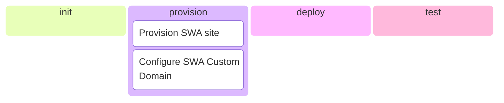

# Endjin.ZeroFailed.Deploy.Vellum

[](https://github.com/endjin/Endjin.ZeroFailed.Deploy.Vellum/actions/workflows/build.yml)
[](https://github.com/endjin/Endjin.ZeroFailed.Deploy.Vellum/releases)
[](https://www.powershellgallery.com/packages/Endjin.ZeroFailed.Deploy.Vellum)
[](https://github.com/endjin/Endjin.ZeroFailed.Deploy.Vellum/blob/main/LICENSE)


A [ZeroFailed](https://github.com/zerofailed/ZeroFailed) extension encapsulating a process to deploy static web sites built using the [Vellum](https://github.com/endjin/Endjin.StaticSiteGen) tooling to Azure.

## Overview

| Component Type | Included | Notes                                                                                                                                                                                                                       |
| -------------- | -------- | --------------------------------------------------------------------------------------------------------------------------------------------------------------------------------------------------------------------------- |
| Tasks          | yes      |                                                                                                                                                                                                                             |
| Functions      | no       |                                                                                                                                                                                                                             |
| Processes      | no       | Lightly extends the process defined by the [ZeroFailed.Deploy.Common](https://github.com/zerofailed/ZeroFailed.Deploy.Common) & [ZeroFailed.Deploy.Azure](https://github.com/zerofailed/ZeroFailed.Deploy.Azure) extensions |

For more information about the different component types, please refer to the [ZeroFailed documentation](https://github.com/zerofailed/ZeroFailed/blob/main/README.md#extensions).

This extension consists of the following features, refer to the [HELP page](./HELP.md) for more details.

- Pre-defined Bicep templates to deploy an Azure Static Web App (SWA) suitable for hosting a Vellum-based web site
- Support for configuring an SWA custom domain when hosted in Azure DNS
- Leverages the [ZeroFailed.Deploy.Azure](https://github.com/zerofailed/ZeroFailed.Build.Azure) extension for most steps

The diagram below shows the discrete features and when they run as part of the default process provided by [ZeroFailed.Deploy.Common](https://github.com/zerofailed/ZeroFailed.Deploy.Common) and extended by [ZeroFailed.Deploy.Azure](https://github.com/zerofailed/ZeroFailed.Deploy.Azure).



## Pre-Requisites

Using this extension requires the following components to be installed:

- [Azure PowerShell modules](https://www.powershellgallery.com/packages/Az/)

## Dependencies

| Extension                                                                          | Reference Type | Version |
| ---------------------------------------------------------------------------------- | -------------- | ------- |
| [ZeroFailed.Deploy.Azure](https://github.com/zerofailed/ZeroFailed.Deploy.Azure)   | git            | `main`  |
| [ZeroFailed.Deploy.Common](https://github.com/zerofailed/ZeroFailed.Deploy.Common) | git            | `main`  |
| [ZeroFailed.DevOps.Common](https://github.com/zerofailed/ZeroFailed.DevOps.Common) | git            | `main`  |

## Getting Started

You should already have your repo setup with a work build process using the [Endjin.ZeroFailed.Build.Vellum](https://github.com/endjin/Endjin.ZeroFailed.Build.Vellum) extension.

Once you have the above setup, then create a new ZeroFailed configuration file in your `.zf` directory (e.g. `.zf/deploy-config.ps1`) and add the following content:

```powershell
$zerofailedExtensions = @(
    ...
    # References the extension from its GitHub repository. If not already installed, use latest version from 'main' will be downloaded.
    @{
        Name = "Endjin.ZeroFailed.Deploy.Vellum"
        GitRepository = "https://github.com/endjin/Endjin.ZeroFailed.Deploy.Vellum"
        GitRef = "main"     # replace this with a Git Tag or SHA reference if want to pin to a specific version
    }

    # Alternatively, reference the extension from the PowerShell Gallery.
    @{
        Name = "Endjin.ZeroFailed.Deploy.Vellum"
        Version = ""   # if no version is specified, the latest stable release will be used
    }
)

# Load the tasks and process
. ZeroFailed.tasks -ZfPath $here/.zf

Set-StrictMode -Version 4

$EnvironmentConfigPath = Join-Path $here '.zf/env-config'

# Synopsis: Use the standard ZeroFailed deployment process
task . FullDeployment
```

## Deployment configuration

The deployment functionality of this extension uses the standard configuration management tooling provided by the [ZeroFailed.Deploy.Common](https://github.com/zerofailed/ZeroFailed.Deploy.Common) extension.

Environment-specific configuration settings for the deployment process are maintained in the consuming repository, allowing it to be versioned alongside the site's other source components.

The configuration area has the following structure:

```
.
├── .zf
│   ├── env-config
│   │   ├── common.ps1              - settings that are common to at least a majority of environments
│   │   ├── dev.ps1                 - settings specific to the 'dev' environment
│   │   ├── prod.ps1                - settings specific to the 'prod' environment
```

When deploying to a given environment the deployment process handles merging the common values with any additional or overridden environment-specific values.  This merged set of values is then used for the remainder of the deployment process.

### Setting-up your first environment

To bootstrap an initial configuration area, follow the steps below:

1. Create the `env-config` folder in the structure shown above
1. Create a `common.ps1` file in the above directory
1. Add the following content to the `common.ps1` file and update the placeholders as required:
    ```powershell
    @{
        RequiredConfiguration = @()
        
        azureTenantId = '<insert-your-azure-tenant-id>'                     # e.g. '1b82fbbd-8ad7-4845-a77a-b0e8c0f48973'
        azureLocation = '<insert-your-preferred-azure-location>'            # e.g. 'WestEurope'
        repositoryUrl = '<insert-the-url-for-source-repo>'                  # e.g. 'https://github.com/myorg/mysite'
        repositoryBranch = 'main'
        appLocationInRepo = '.dist/'
    }
    ```
1. Create a new `.ps1` configuration file in the `config` folder, using the name of your first environment (e.g. `dev.ps1`)
1. Add the following content to this file and update the placeholders as required:
    ```powershell
    @{
        azureSubscriptionId = '<azure-subscription-id>'
        resourceGroupName = '<target-resource-group-name>'
        siteName = '<static-web-app-site-name>'
        staticWebAppSku = 'Standard'    # 'Free' or 'Standard'
        customDomain = ''               # If using a custom domain enter it here, otherwise this functionality will not be enabled
        useAzureDns = $false            # When true, this will create the DNS zone (for the above domain) alongside the SWA site resource and configure for use as the custom domain
    }
    ```

### Configuring an additional environment

You can setup additional environments by following the simple steps below:

1. Copy and rename the `.ps1` file used by your first environment (e.g. `prod.ps1`)
1. Review and update the configuration settings to ensure the values are correct for the new environment

## Running the deployment process

Once the above environment configuration has been complete, you are ready to test the deployment of your web site.

1. Open a PowerShell 7+ terminal
1. Navigate to the root of your site's source repository
1. Ensure you are connected to Az.PowerShell with permissions to create resources and configure RBAC in the target subscription or resource group
    ```
    PS:> Connect-AzAccount
    ```
1. Run the deployment process, using the appropriate environment name:
    ```
    PS:> ./deploy.ps1 -EnvironmentName dev
    ```

## Usage

For an example of using this extension to deploy a Vellum-based static web site, please take a look at [this example repo](https://github.com/endjin/fabric-weekly-info).